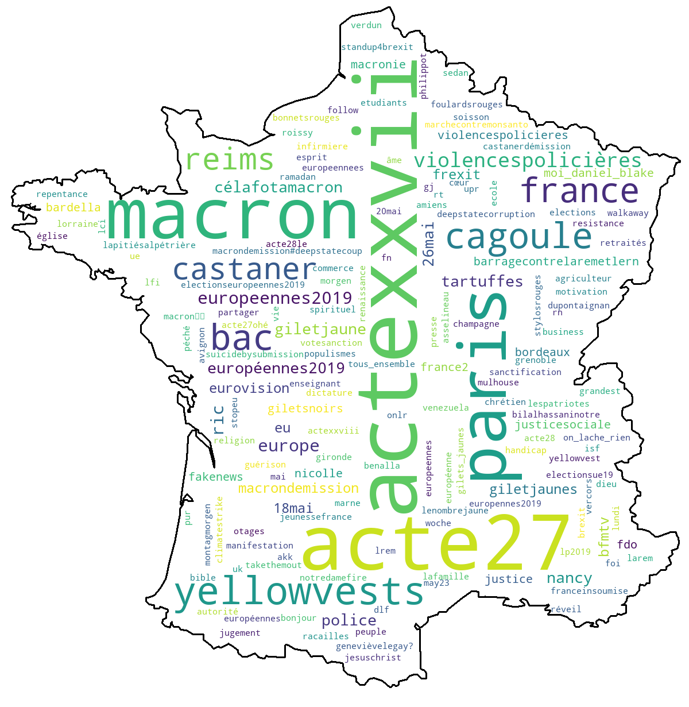

# What We Tweet About ...
Python

I recently discovered a very nice python lib called [wordcloud](https://amueller.github.io/word_cloud/ "WordCloud for Python documentation") and I wanted to play with it. I am writing this tutorial, after a couple of days of experimentation, to explain how to use `wordcloud` to generate a cloud of the most frequent **#hashtags**, extracted from twitter, related to a search query.



At the end of this tutorial, you should be able to generate the image above -- the words on the image match the **#hashtags** related to "*gilets jaunes*" ([yellow vest](https://en.wikipedia.org/wiki/Yellow_vests_movement)).

The main steps can be listed as follows :

1.   **Search query execution (through the Twitter API)**
2.   **Hashtags extraction (+ Frequency map construction)**
3.   **Wordcloud creation (from a frequency map) + Image generation**

## First things first : the python environment

First of all, I have to admit that [wordcloud](https://amueller.github.io/word_cloud/ "WordCloud for Python documentation") is not the only python library I used. Here is the complete set of dependencies :

- [numpy](https://www.numpy.org "NumPy is the fundamental package for scientific computing with Python.") : to manipulate arrays of pixels.
- [twython](https://github.com/ryanmcgrath/twython "Actively maintained, pure Python wrapper for the Twitter API") : to search for tweets
- [re](https://docs.python.org/2/library/re.html, "Regular expression operations") : to parse the tweets.
- [PIL](https://pillow.readthedocs.io/en/stable/ "Python Imaging Library") : to turn an image into an array of pixels.

NB: You would probably make a great use of [virtualenv](https://virtualenv.pypa.io/en/latest/ "virtualenv is a tool to create isolated Python environments") in other to work in a dedicated and clean environment.

## Step 1. Search query execution (through the Twitter API)

You need to apply for access tokens from the twitter dev platform to be able to use their research API -- the standard (free) plan is sufficient for this tutorial (please refer to [their website](https://developer.twitter.com/en/apply-for-access "All new developers must apply for a developer account to access Twitter APIs. Once approved, you can begin to use our standard APIs and our new premium APIs.") and come back when you are done). Save your credentials - `CONSUMER_KEY`, `CONSUMER_SECRET`, `ACCESS_TOKEN`, `ACCESS_SECRET` - as a json file somewhere in your disk.

I suggest you the following function - `collectAndSaveTweets` - to collect and save your tweets. Here is a simple description of the most important parameters of `collectAndSaveTweets`:

* `searchtoken` : the keywords to search for
* `credentialfilepath` : you credential file path (`json` format)
* `tweetfilepath` : where you want to save your tweets (`text` file)
* `language` : search for tweet in this specific language

```python
import json
from twython import Twython
def collectAndSaveTweets(
	searchtoken,
	credentialfilepath,
	tweetfilepath,
	maxattempts,
	nboftweetstobefetch,
	language
):
	# credential parameters
	with open(credentialfilepath, mode='r') as f:
		d = json.load(f)

	# session object
	api = Twython(d['CONSUMER_KEY'], d['CONSUMER_SECRET'],
               d['ACCESS_TOKEN'], d['ACCESS_SECRET'])

	# Check if the connexion is successful
	api.verify_credentials()

	# file that holds the tweets
	tweetfile = open(tweetfilepath, 'w')

	# tweet count
	tweets = 0

	# apply a search query using the API
	for i in range(0, maxattempts):

		if(nboftweetstobefetch < tweets):
			break

		# Query Twitter:
		if(0 == i):
			results = api.search(
				q=searchtoken,
				count=1000,
				lang=language,
				tweet_mode='extended'
			)
		else:
			# After the first call we should have
			# max_id from result of previous call.
			# Pass it in query. Use the extended mode to get
			# all the content of the tweet and not a truncated version.
			results = api.search(
				q=searchtoken,
				include_entities='true',
				max_id=next_max_id,
				tweet_mode='extended'
			)

		# Save the returned tweets :
		# Tweets content are truncated
		# (even in the extended mode) when retweeted.
		# If it is the case, the full text of the
		# original tweet is in the retweeted_status
		# field of the JSON response.
		for result in results['statuses']:
			if 'retweeted_status' in result:
				tweetfile.write(result['retweeted_status']['full_text'])
			else:
				tweetfile.write(result['full_text'])
			tweets += 1

		# Get the next max_id to iterate over the results:
		try:
			next_results_url_params = results['search_metadata']['next_results']
			next_max_id = next_results_url_params.split('max_id=')[1].split('&')[0]
		except:
			break

	# close the file thats holds the tweets
	tweetfile.close()
```

Everything should be fine from here if you have properly created your access tokens.

You should be able to try some queries and see the results in a text file (remember that the language is very important - see [here](https://en.wikipedia.org/wiki/List_of_ISO_639-1_codes "List of ISO 639 codes") for details)

## Step 2. Hashtags extraction (+ Frequency map construction)

In order to use [wordcloud](https://amueller.github.io/word_cloud/ "WordCloud for Python documentation"), you will need to generate a word frequency map. My suggestion is to use the function `getFrequencyDictForText` below. The function takes a text and a filter object -- defined by `FilterObj` class -- as parameters and builds the frequency map for the hashtags (in the input text) that satisfy a given filtering condition.

You will have all the freedom to define your filtering condition in the `__call__` function of the `FilterObj` object.

```python
import re
def getFrequencyDictForText(fulltext, filterobj):
	result = {}
	for textblock in re.split('[\s\n,\.]+', fulltext):
		if filterobj(textblock):
			val = result.get(textblock.lower()[1:], 0)
			result[textblock.lower()[1:]] = val + 1
	return result

# The filter object (we can easily modify it according to our need).
class FilterObj(object):
    def __init__(self, *tabuwords):
        self.__tabuwords = tabuwords
    def __call__(self, text):
        isnotin = lambda tabu: (text.lower().find(tabu)==-1)
        return re.match("^#", text) and all(map(isnotin, self.__tabuwords))
```

We are going to call this function on the full content of our tweets file and generate a frequency map. Then we will process the frequency map in other to generate the cloud that we want. This is where `wordcloud` comes into the game.

## Step 3. Wordcloud creation (from a frequency map) + Image generation

The function `makeImage` is the last ingredient for our cloud creation process. It takes a frequency map and turns it into an image with the help of `wordcloud`. Below, a simple description of the most important parameters of `makeImage`:

* `tweetsfrequencymap` : the frequency map of the hashtags related to our query. They should have been processed according to our needs (see the previous section)
* `pathtomask` : the path to the black an white image that will be used to bound the cloud (the map of France in the example above)
* `outputpath` : the output path for the resulting image
* `backgroundcolor` : the backgroud color of the image
* `contourcolor` : the color of the boundaries
* `contourwith` : the thickness of the boundaries


```python
import numpy as np
import wordcloud
from PIL import Image
def makeImage(
    tweetsfrequencymap,
    pathtomask,
    outputpath,
    contourwidth=3,
    backgroundcolor='white',
    contourcolor='black'
):
	mask = np.array(Image.open(pathtomask, mode='r'))
	wc = WordCloud(
		background_color=background_color,
		mask=mask,
		contour_width=contourwidth,
		contour_color=contourcolor
	)
	# generate word cloud
	wc.generate_from_frequencies(tweetsfrequencymap)
	wc.to_file(outputpath)
```

Voila! Put all these functions (and the class definition of `FilterObj`) in a python file and add the following lines of code at the end. You are ready to roll !

```python

if __name__ == '__main__':

	# keywords to search for
	SEARCHTOKEN = input('enter the search token:')

	# global parameters
	PATHTOTHEJSONFILE = "./credentials.json"
	TWEETSFILEPATH = "./tweets.txt"
	MASKIMAGEPATH = "./temporary/test.png"
	OUTPUTPATH = "output.png"
	LANG = "fr"

	# collect and save the tweets
	collectAndSaveTweets(
		SEARCHTOKEN,
		PATHTOTHEJSONFILE,
		TWEETSFILEPATH,
		language=LANG
	)

	# build a frequency map from the tweets
	tweetfile = open(TWEETSFILEPATH, mode='r')
	fulltext = tweetfile.read()
	filterobj = FilterObj(*re.split('\s', SEARCHTOKEN))

	# generate cloud and save into image
	makeImage(
		getFrequencyDictForText(fulltext, filterobj),
		maskimagepath=MASKIMAGEPATH,
		outputpath=OUTPUTPATH
	)
```

I have used this worflow to generate several #hashtags clouds. You will find some examples at the end of the document.

I you have enjoyed this article. Feel free to send us some comments.

Patrick S. Kanmeugne *for geodatascience.io*

{::nomarkdown}


>, generated on the 15st of May 2019"/>
{:/}

I hope you enjoyed reading this article. Feel free to give me some feedbacks.


